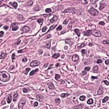

# Generative-AI

## Class-Conditioned Diffusion Model Sampling
- Medical image sampling using DDIMSampler

| Class | Real Image | Synthetic Image |
|-------|------------|-----------------|
| lr    |  |  |
| ld    |  |  |
| mc    |  |  |
| ns    |  |  |

UMAP plot of synthetic and real image feature vectors. CONCH [Link Text](https://huggingface.co/MahmoodLab/CONCH) is used as a histopathology feature extractor.

